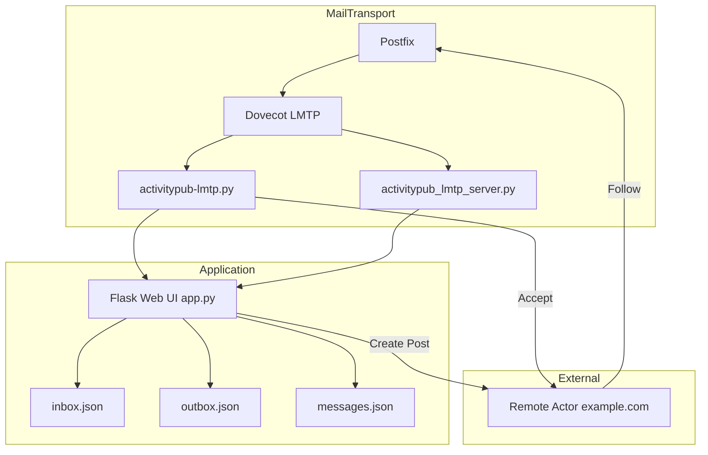
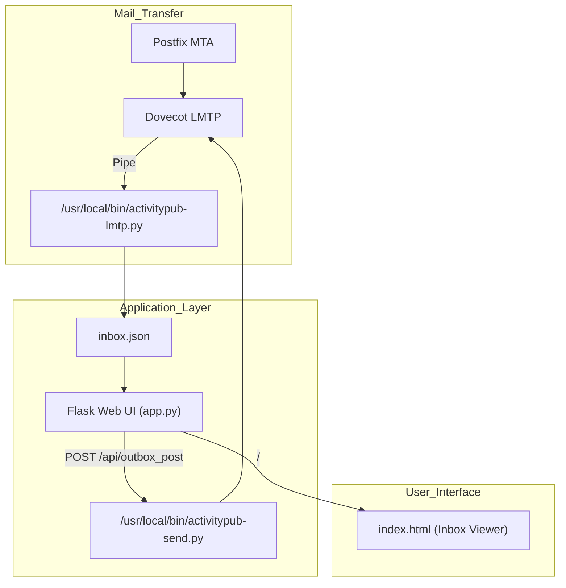

# 📨 MTA-based ActivityPub Framework
**MTAベースの分散SNS通信基盤**  
Postfix + Dovecot + LMTP を活用し、ActivityPub メッセージを「メール伝送」で処理する新しい分散SNS基盤です。  
HTTPではなく **SMTP/LMTPをIPC（プロセス間通信）として再利用**し、フォロー・投稿・返信をMTAキューで管理します。

---

## 🌐 概要
このプロジェクトは、**電子メール（MTA）をActivityPubメッセージの伝送層として使う**  
新しい分散SNSの通信基盤です。

- 各ノードが **「メールボックス＝Inbox/Outbox」** を持ちます  
- ActivityPub メッセージを SMTP / LMTP で配送  
- MTAキューを活用して **非同期・再送制御・スパム対策** を自動適用  
- すべてのノードは Postfix / Dovecot / LMTP に準拠した構成で相互通信可能  

---

## 🧩 アーキテクチャ


---

## 📂 ディレクトリ構成

```bash
/usr/local/bin/
├── activitypub-inbox.py          # 旧バージョンの受信処理（保持のみ）
├── activitypub-lmtp.py           # LMTPハンドラ本体（Follow受信→Accept返信）
├── activitypub-send.py           # LMTP経由でActivityPubメッセージを送信
├── activitypub_lmtp_server.py    # LMTPサーバ実装（dovecot連携用）

/var/www/activitypub/
├── app.py                        # Flask Web UI本体（Inbox / Outbox 管理画面）
├── inbox.json                    # 受信メッセージ（LMTP経由で追加）
├── outbox.json                   # 送信メッセージ履歴
├── messages.json                 # Web UIでの統合ビュー
├── templates/
│   └── index.html                # Inbox/Outboxビュー（Follow/Acceptフィルタ付き）
└── Maildir/                      # Dovecotローカルメール保存領域
```

---

## 🧩 アーキテクチャ図（Mermaid）

この構成により、ActivityPubのメッセージ（Follow / Accept / Createなど）を
メール伝送（LMTP）経由で自動処理・可視化できます。

---

## 🚀 起動方法（Docker Compose）
```bash
git clone https://github.com/<yourname>/mta-activitypub.git
cd mta-activitypub

docker-compose up -d
```

- 主要コンテナ

| サービス | 役割 |
|-----------|------|
| postfix | メール送信・配送制御 |
| dovecot | LMTP配信先（activitypub-lmtp.pyへパイプ） |
| web | Flaskアプリ（/var/www/activitypub/app.py） |
| lmtp | LMTPサーバ（127.0.0.1:2626で受信） |

---

## 💡 ユースケース
### 📨 Follow / Accept
1. https://example.com/users/alice が https://ipcnode.local/users/follow に Follow を送信

2. activitypub-lmtp.py が受信し、Accept を自動生成

3. Accept メッセージが LMTP 経由で返信され、inbox.json と outbox.json に反映

4. Web UI (/) で一覧表示、フィルタ切替可

---

## 📝 Create（投稿）
1. Web UI から type=Create のJSONを送信

2. LMTP経由で inbox.json に反映（ローカル投稿／リモート配送テスト対応予定）

---

## 💻 Web UI 機能

| 機能 | 説明 |
|------|------|
| 📬 **Inbox Viewer** | LMTPで受信したメッセージを一覧表示 |
| 📨 **Accept自動返信** | Follow受信時、自動でAccept生成 |
| 📤 **Outbox投稿** | WebフォームやAPIからFollow / Create送信 |
| 🔍 **フィルタ表示** | Follow / Accept / Create 切り替え |
| 🧩 **API** | `/api/inbox`, `/api/outbox`, `/api/outbox_post` |

---

## 🧠 開発の狙い
- MTAを「分散ノード通信層」として再定義
- ActivityPubを“メール的分散システム”として再実装
- MastodonやThreadsのような分散SNSをメールプロトコルで実現

---

## 🧰 技術スタック
- Python 3.11
- Flask
- Postfix / Dovecot
- LMTP (Local Mail Transfer Protocol)
- JSON-based ActivityPub
- Docker Compose

---

## 🔧 今後の開発予定
- Create（投稿）アクティビティ対応
- Undo（フォロー解除）対応
- InboxのWebSocket反映
- Mastodonノードとの相互通信テスト

---

## 📜 ライセンス
MIT License
Copyright © 2025 Yoichi T.

