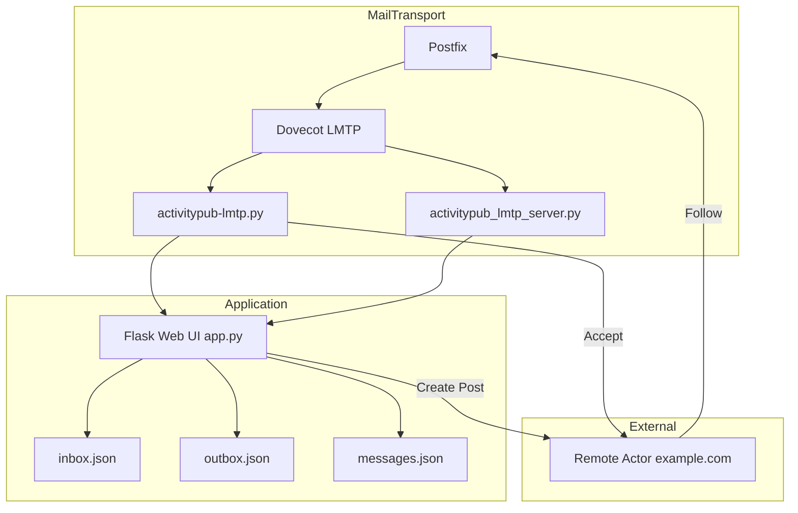

# 📨 MTA-based ActivityPub Framework
**MTAベースの分散SNS通信基盤**  
Postfix + Dovecot + LMTP を活用し、ActivityPub メッセージを「メール伝送」で処理する新しい分散SNS基盤です。  
HTTPではなく **SMTP/LMTPをIPC（プロセス間通信）として再利用**し、フォロー・投稿・返信をMTAキューで管理します。

---

## 🌐 概要
このプロジェクトは、**電子メール（MTA）をActivityPubメッセージの伝送層として使う**  
新しい分散SNSの通信基盤です。

- 各ノードが **「メールボックス＝Inbox/Outbox」** を持ちます  
- ActivityPub メッセージを SMTP / LMTP で配送  
- MTAキューを活用して **非同期・再送制御・スパム対策** を自動適用  
- すべてのノードは Postfix / Dovecot / LMTP に準拠した構成で相互通信可能  

---

## 🧩 アーキテクチャ


---

## 📂 ディレクトリ構成

```bash
/usr/local/bin/
├── activitypub-inbox.py          # 旧バージョンの受信処理（保持のみ）
├── activitypub-lmtp.py           # LMTPハンドラ本体（Follow受信→Accept返信）
├── activitypub-send.py           # LMTP経由でActivityPubメッセージを送信
├── activitypub_lmtp_server.py    # LMTPサーバ実装（dovecot連携用）

/var/www/activitypub/
├── app.py                        # Flask Web UI本体（Inbox / Outbox 管理画面）
├── inbox.json                    # 受信メッセージ（LMTP経由で追加）
├── outbox.json                   # 送信メッセージ履歴
├── messages.json                 # Web UIでの統合ビュー
├── templates/
│   └── index.html                # Inbox/Outboxビュー（Follow/Acceptフィルタ付き）
└── Maildir/                      # Dovecotローカルメール保存領域
```

---

## 🧩 アーキテクチャ図（Mermaid）
```mermaid
graph TD
    subgraph Mail Transfer
        A[Postfix MTA] --> B[Dovecot LMTP]
        B -->|Pipe| C[/usr/local/bin/activitypub-lmtp.py]
    end

    subgraph Application Layer
        C --> D[inbox.json]
        D --> E[Flask Web UI (app.py)]
        E -->|POST /api/outbox_post| F[/usr/local/bin/activitypub-send.py]
        F --> B
    end

    subgraph User Interface
        E -->|/| G[index.html (Inbox Viewer)]
    end
```


